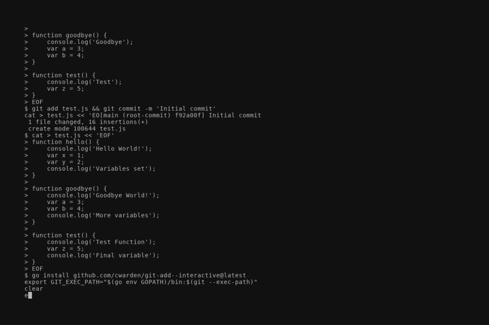

# Git Add Interactive (Go Implementation)

A Go port of Git's interactive add functionality, providing the same interface as `git add -i` and `git add -p`, with a few enhancements.



## Features

- **Interactive staging**: Select files and hunks to stage interactively
- **Patch mode**: Review and selectively stage individual hunks with `y/n/s/e/q/a/d` commands
- **Hunk operations**: Split hunks, manually edit hunks, navigate between hunks
- **Multiple patch modes**: Support for stage, reset, checkout, stash, and worktree operations
- **Git integration**: Full Git color configuration and repository support
- **Terminal UI**: Color-coded interface with keyboard shortcuts

## Enhancements Over Perl Version

This Go implementation adds several powerful features beyond the original Perl script:

### Global Filtering (G command)
Filter hunks across all files using regex patterns:

```
G <regex>    # Set global filter to show only hunks matching pattern
G            # Clear filter (interactive prompt for new pattern)
```

**Example workflows:**
- `G TODO` - Show only hunks containing "TODO" comments
- `G import` - Focus on import statement changes
- `G console\.log` - Find all debugging statements

### Auto-Splitting (S command)
Automatically split all hunks to maximum granularity:
```
S    # Enable auto-splitting globally and split all hunks
```

This recursively splits hunks until no further splitting is possible, giving you the finest possible control over what gets staged.

### Accept All (A command)
Accept all hunks across all files (after filtering and splitting):
```
A    # Accept all visible hunks in all remaining files
```

**Powerful workflow combinations:**
- `S` → `G <pattern>` → `A` - Split everything, filter by pattern, accept all matches
- `G console\.log` → `A` - Quickly stage all debugging code across your entire changeset

### Enhanced Search and Navigation
- **Local search (`/`)**: Search within current file without affecting global filter
- **Status display**: Shows `[filter: pattern]` and `[auto-split]` indicators
- **Cross-file filtering**: Global filters persist across all files in the session

## Installation

### Build the Binary
```bash
go build .
```

### Install as Git Command (Optional)
To use this implementation as the default `git add -i` and `git add -p`, you can install it to your Go bin directory and update your Git exec path:

```bash
# Build and install to Go bin directory
go build -o "$(go env GOPATH)/bin/git-add--interactive" .

# Add Go bin to Git's exec path (add to your shell profile for persistence)
export GIT_EXEC_PATH="$(go env GOPATH)/bin:$(git --exec-path)"
```

After setting this up, `git add -i` and `git add -p` will use the Go implementation instead of the Perl script.

### Verify Installation
```bash
# Check which git-add--interactive is being used
which git-add--interactive

# Test interactive add
git add -i

# Test patch mode
git add -p
```

### Uninstall (Revert to Original)
To revert back to the original Perl implementation:

```bash
# Remove the Go binary from your Go bin
rm "$(go env GOPATH)/bin/git-add--interactive"

# Reset Git exec path (remove from your shell profile too)
unset GIT_EXEC_PATH
# Or set it back to default
export GIT_EXEC_PATH="$(git --exec-path)"
```

## Usage

### Direct Usage
```bash
# Run directly
./git-add--interactive

# Or if installed as Git command
git add -i
```

This launches the main interactive menu with options:
- `status` - Show paths with changes
- `update` - Add working tree state to staged changes  
- `revert` - Revert staged changes back to HEAD
- `add untracked` - Add untracked files to staged changes
- `patch` - Pick hunks and update selectively
- `diff` - View diff between HEAD and index
- `quit` - Exit the program
- `help` - Show help

### Patch Mode
```bash
# Direct usage
./git-add--interactive --patch --
./git-add--interactive --patch=stage --
./git-add--interactive --patch=reset --
./git-add--interactive --patch=checkout --

# Or if installed as Git command
git add -p              # Same as --patch
git add --patch         # Stage mode
git reset -p            # Reset mode  
git checkout -p         # Checkout mode
```

Patch mode allows you to interactively select hunks with these commands:
- `y` - Accept this hunk
- `n` - Skip this hunk  
- `q` - Quit; skip this hunk and remaining ones
- `a` - Accept this hunk and all later hunks in the file
- `d` - Skip this hunk and all later hunks in the file
- `s` - Split the current hunk into smaller hunks
- `e` - Manually edit the current hunk
- `j/k` - Navigate to next/previous undecided hunk
- `J/K` - Navigate to next/previous hunk
- `g` - Go to a specific hunk number
- `/` - Search for pattern in current file
- `G` - Set global filter for all files (or clear with empty pattern)
- `S` - Enable auto-splitting globally and split all hunks
- `A` - Accept all hunks in all remaining files
- `?` - Show help

## Architecture

The codebase is organized into these main packages:

- `main.go` - Entry point and command-line parsing
- `internal/git/` - Git repository interaction and operations
  - `repository.go` - Git repository abstraction and command execution
  - `status.go` - File status parsing and tracking  
  - `patch.go` - Diff parsing and patch mode operations
- `internal/ui/` - Interactive terminal interface
  - `app.go` - Main application logic and menu system
  - `patch.go` - Patch mode UI and hunk interaction

## Testing

Run the test suite:
```bash
go test ./...
```

Run tests with verbose output:
```bash
go test -v ./...
```

## Development

The code follows Go conventions and includes:
- Comprehensive unit tests for core functionality
- Git integration respecting user's color and configuration
- Error handling for edge cases and invalid input
- Support for all major patch modes and operations

## Compatibility

This implementation provides the same functionality as the original Perl `git-add--interactive` script, including:
- All patch modes (stage, reset, checkout, stash, worktree variants)
- Full hunk manipulation (splitting, editing, navigation)
- Git color configuration support
- Interactive selection with prefix matching
- Range and comma-separated selections
